# One Hundred and Fifty Publication-Quality Figures

[](https://github.com/ktwyw/publication-figures/actions/workflows/verify.yml)
[](LICENSE)
[](LICENSE-FIGURES.md)

**150 standalone matplotlib scripts** for the figure types scientists and
engineers actually publish -- statistics, materials characterization,
transport phenomena, electrochemistry, Ashby charts, classics from
across engineering, and manuscript panels for genomics, clinical
research, machine learning, networks and imaging. Every curve is **derived from governing equations**
(never sketched), every random draw is **seeded**, and wherever the
physics fixes a landmark the script **checks itself** with an `assert`
-- the Wien locus threads every Planck peak, Mohr circles touch the
envelope exactly, the Carnot loop integral equals its T-s rectangle.
One shared style sheet keeps the whole set consistent; each script
writes a 600-dpi PNG and a submission-ready vector PDF.

**The companion guide** ([`figures/figure_guide.pdf`](figures/figure_guide.pdf))
distils the craft: Part I the eight habits these scripts embody, Part II
the illustrated catalog of all 150, Part III sixteen named failure
patterns (each harvested from a real bug), Part IV working checklists.

## Quick start

```bash
git clone https://github.com/ktwyw/publication-figures.git
cd publication-figures
pip install -r requirements.txt
python figures/fig001_curve_fit.py      # any script runs standalone
make figures                            # or render all 150
make guide gallery                      # rebuild the PDF guide + gallery
```

## The catalog

One line per figure lives in [`figures/README.md`](figures/README.md)
(the single source of truth the guide is typeset from). Sections:
**A** statistical & general data graphics (1-50) - **B** chemistry &
materials characterization (51-60) - **C** case study: reproducing a
journal theory figure (61) - **D** transport phenomena & reactors
(62-67) - **E** chem-eng & materials classics (68-73) -
**F** electrochemistry, stability & selection (74-79) - **G** Ashby
charts on the shared module (80-81) - **H** across science &
engineering (82-100) - **I** manuscript panels at exact printed size
(101-120) - **J** beyond the standard chart: evidence panels across
fields, on the same exact-size module (121-150).

## Gallery

Click any thumbnail to open its script.

<table>
<tr><td align="center"><a href="figures/fig001_curve_fit.py"></a></td><td align="center"><a href="figures/fig002_multipanel.py"></a></td><td align="center"><a href="figures/fig003_regression_ci.py"></a></td><td align="center"><a href="figures/fig004_bars_stats.py"></a></td><td align="center"><a href="figures/fig005_heatmap.py"></a></td></tr>
<tr><td align="center"><a href="figures/fig006_raincloud.py"></a></td><td align="center"><a href="figures/fig007_kaplan_meier.py"></a></td><td align="center"><a href="figures/fig008_volcano.py"></a></td><td align="center"><a href="figures/fig009_spectrum_inset.py"></a></td><td align="center"><a href="figures/fig010_loglog_powerlaw.py"></a></td></tr>
<tr><td align="center"><a href="figures/fig011_image_scalebar.py"></a></td><td align="center"><a href="figures/fig012_forest_plot.py"></a></td><td align="center"><a href="figures/fig013_roc_curves.py"></a></td><td align="center"><a href="figures/fig014_joint_marginals.py"></a></td><td align="center"><a href="figures/fig015_clustered_heatmap.py"></a></td></tr>
<tr><td align="center"><a href="figures/fig016_paired_slope.py"></a></td><td align="center"><a href="figures/fig017_contour_map.py"></a></td><td align="center"><a href="figures/fig018_bland_altman.py"></a></td><td align="center"><a href="figures/fig019_ridgeline.py"></a></td><td align="center"><a href="figures/fig020_coefficients.py"></a></td></tr>
<tr><td align="center"><a href="figures/fig021_stacked_composition.py"></a></td><td align="center"><a href="figures/fig022_streamplot.py"></a></td><td align="center"><a href="figures/fig023_wind_rose.py"></a></td><td align="center"><a href="figures/fig024_qq_plot.py"></a></td><td align="center"><a href="figures/fig025_calibration.py"></a></td></tr>
<tr><td align="center"><a href="figures/fig026_sankey.py"></a></td><td align="center"><a href="figures/fig027_pca_biplot.py"></a></td><td align="center"><a href="figures/fig028_waterfall.py"></a></td><td align="center"><a href="figures/fig029_time_series_events.py"></a></td><td align="center"><a href="figures/fig030_fan_chart.py"></a></td></tr>
<tr><td align="center"><a href="figures/fig031_upset.py"></a></td><td align="center"><a href="figures/fig032_dose_response.py"></a></td><td align="center"><a href="figures/fig033_confusion_matrix.py"></a></td><td align="center"><a href="figures/fig034_training_curves.py"></a></td><td align="center"><a href="figures/fig035_manhattan.py"></a></td></tr>
<tr><td align="center"><a href="figures/fig036_ternary.py"></a></td><td align="center"><a href="figures/fig037_raster_psth.py"></a></td><td align="center"><a href="figures/fig038_small_multiples.py"></a></td><td align="center"><a href="figures/fig039_ecdf_comparison.py"></a></td><td align="center"><a href="figures/fig040_carpet_plot.py"></a></td></tr>
<tr><td align="center"><a href="figures/fig041_dumbbell.py"></a></td><td align="center"><a href="figures/fig042_split_violin.py"></a></td><td align="center"><a href="figures/fig043_broken_axis.py"></a></td><td align="center"><a href="figures/fig044_hexbin_density.py"></a></td><td align="center"><a href="figures/fig045_funnel_plot.py"></a></td></tr>
<tr><td align="center"><a href="figures/fig046_bubble_chart.py"></a></td><td align="center"><a href="figures/fig047_superplot.py"></a></td><td align="center"><a href="figures/fig048_tornado.py"></a></td><td align="center"><a href="figures/fig049_energy_levels.py"></a></td><td align="center"><a href="figures/fig050_bode_plot.py"></a></td></tr>
<tr><td align="center"><a href="figures/fig051_xrd.py"></a></td><td align="center"><a href="figures/fig052_tga_dsc.py"></a></td><td align="center"><a href="figures/fig053_stress_strain.py"></a></td><td align="center"><a href="figures/fig054_cyclic_voltammetry.py"></a></td><td align="center"><a href="figures/fig055_nyquist_eis.py"></a></td></tr>
<tr><td align="center"><a href="figures/fig056_isotherm_psd.py"></a></td><td align="center"><a href="figures/fig057_arrhenius.py"></a></td><td align="center"><a href="figures/fig058_phase_diagram.py"></a></td><td align="center"><a href="figures/fig059_ftir_stack.py"></a></td><td align="center"><a href="figures/fig060_tauc_bandgap.py"></a></td></tr>
<tr><td align="center"><a href="figures/fig061_carreau_flowcurve.py"></a></td><td align="center"><a href="figures/fig062_moody.py"></a></td><td align="center"><a href="figures/fig063_falkner_skan.py"></a></td><td align="center"><a href="figures/fig064_thiele.py"></a></td><td align="center"><a href="figures/fig065_rtd_tanks.py"></a></td></tr>
<tr><td align="center"><a href="figures/fig066_vdw_maxwell.py"></a></td><td align="center"><a href="figures/fig067_transient_conduction.py"></a></td><td align="center"><a href="figures/fig068_mccabe_thiele.py"></a></td><td align="center"><a href="figures/fig069_tafel.py"></a></td><td align="center"><a href="figures/fig070_breakthrough.py"></a></td></tr>
<tr><td align="center"><a href="figures/fig071_ellingham.py"></a></td><td align="center"><a href="figures/fig072_ttt.py"></a></td><td align="center"><a href="figures/fig073_common_tangent.py"></a></td><td align="center"><a href="figures/fig074_pourbaix.py"></a></td><td align="center"><a href="figures/fig075_ashby.py"></a></td></tr>
<tr><td align="center"><a href="figures/fig076_residue_curves.py"></a></td><td align="center"><a href="figures/fig077_hallpetch_weibull.py"></a></td><td align="center"><a href="figures/fig078_evans.py"></a></td><td align="center"><a href="figures/fig079_cstr_multiplicity.py"></a></td><td align="center"><a href="figures/fig080_ashby_strength_density.py"></a></td></tr>
<tr><td align="center"><a href="figures/fig081_ashby_toughness_modulus.py"></a></td><td align="center"><a href="figures/fig082_smith_chart.py"></a></td><td align="center"><a href="figures/fig083_ber_waterfall.py"></a></td><td align="center"><a href="figures/fig084_buckley_leverett.py"></a></td><td align="center"><a href="figures/fig085_mohr_coulomb.py"></a></td></tr>
<tr><td align="center"><a href="figures/fig086_streeter_phelps.py"></a></td><td align="center"><a href="figures/fig087_antenna_patterns.py"></a></td><td align="center"><a href="figures/fig088_roofline_amdahl.py"></a></td><td align="center"><a href="figures/fig089_arps_decline.py"></a></td><td align="center"><a href="figures/fig090_influence_lines.py"></a></td></tr>
<tr><td align="center"><a href="figures/fig091_response_spectrum.py"></a></td><td align="center"><a href="figures/fig092_activated_sludge.py"></a></td><td align="center"><a href="figures/fig093_planck_blackbody.py"></a></td><td align="center"><a href="figures/fig094_qho_wavefunctions.py"></a></td><td align="center"><a href="figures/fig095_titration_curves.py"></a></td></tr>
<tr><td align="center"><a href="figures/fig096_eye_diagram.py"></a></td><td align="center"><a href="figures/fig097_pz_material_balance.py"></a></td><td align="center"><a href="figures/fig098_terzaghi_consolidation.py"></a></td><td align="center"><a href="figures/fig099_double_slit.py"></a></td><td align="center"><a href="figures/fig100_carnot_cycle.py"></a></td></tr>
<tr><td align="center"><a href="figures/fig101_grouped_bars_planned.py">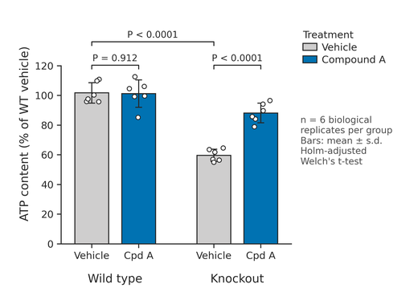</a></td><td align="center"><a href="figures/fig102_tumour_growth_arms.py">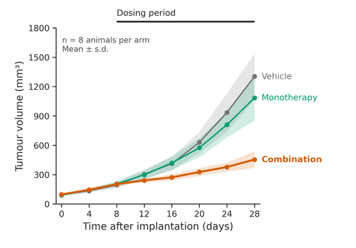</a></td><td align="center"><a href="figures/fig103_volcano_bh.py">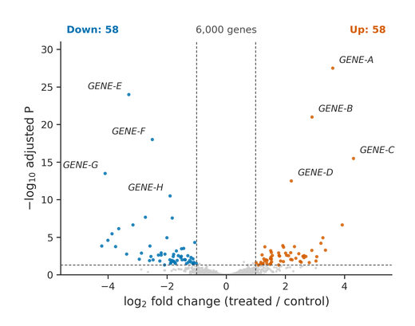</a></td><td align="center"><a href="figures/fig104_clustermap_annotated.py">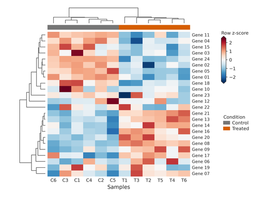</a></td><td align="center"><a href="figures/fig105_raincloud_kruskal.py">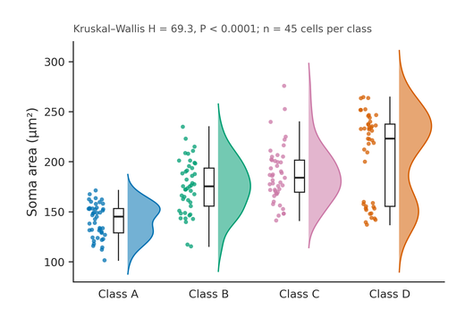</a></td></tr>
<tr><td align="center"><a href="figures/fig106_regression_marginals.py">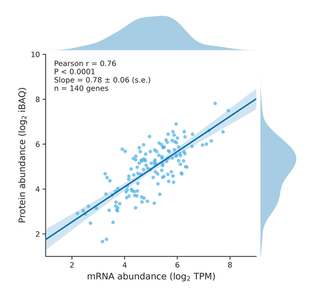</a></td><td align="center"><a href="figures/fig107_km_confidence_bands.py">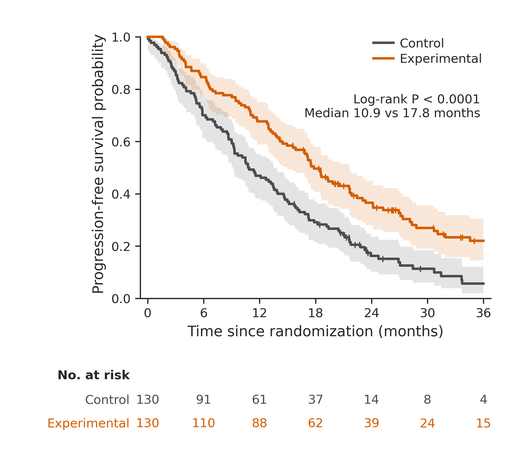</a></td><td align="center"><a href="figures/fig108_subgroup_forest.py">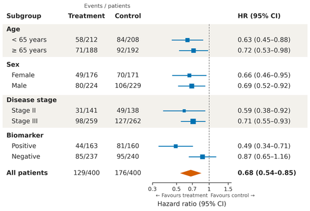</a></td><td align="center"><a href="figures/fig109_roc_pr_bootstrap.py">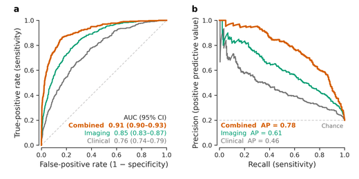</a></td><td align="center"><a href="figures/fig110_dose_response_ci.py">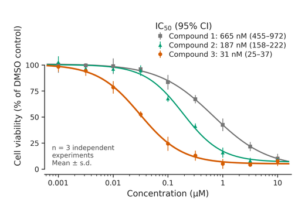</a></td></tr>
<tr><td align="center"><a href="figures/fig111_embedding_dotplot.py">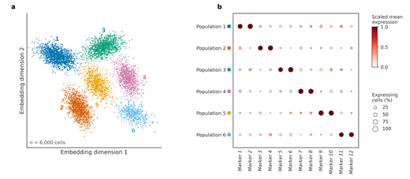</a></td><td align="center"><a href="figures/fig112_composition_diversity.py">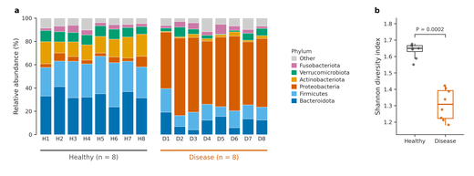</a></td><td align="center"><a href="figures/fig113_response_surface_fit.py">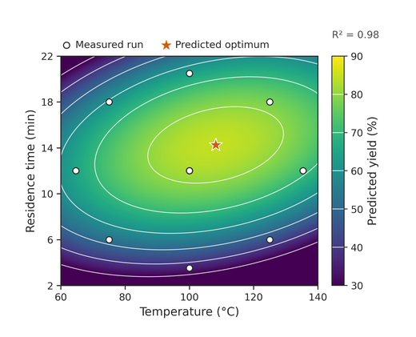</a></td><td align="center"><a href="figures/fig114_manhattan_loci.py">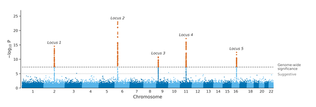</a></td><td align="center"><a href="figures/fig115_paired_estimation.py">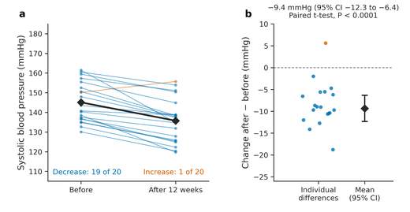</a></td></tr>
<tr><td align="center"><a href="figures/fig116_model_benchmark.py">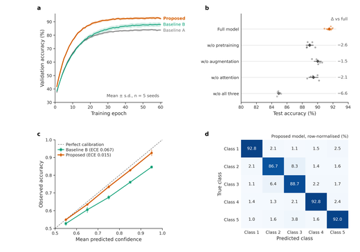</a></td><td align="center"><a href="figures/fig117_xrd_annealing.py">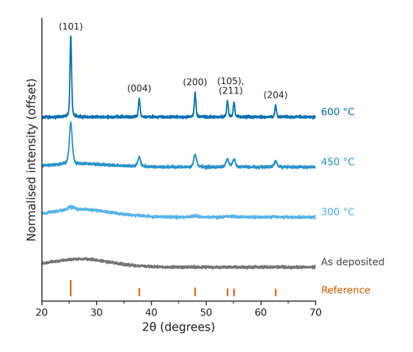</a></td><td align="center"><a href="figures/fig118_raster_psth_sem.py">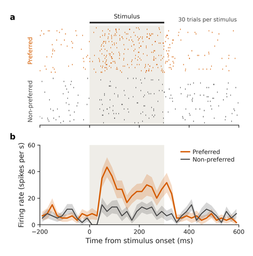</a></td><td align="center"><a href="figures/fig119_image_plate_quant.py">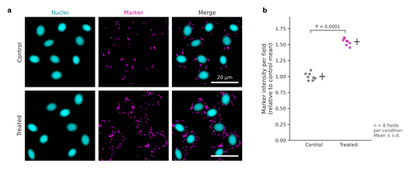</a></td><td align="center"><a href="figures/fig120_hero_composite.py">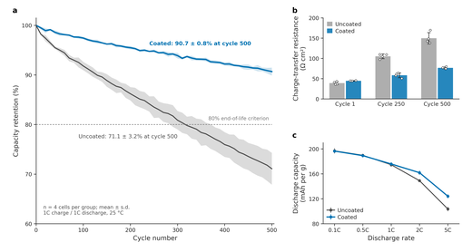</a></td></tr>
<tr><td align="center"><a href="figures/fig121_radar_benchmark.py">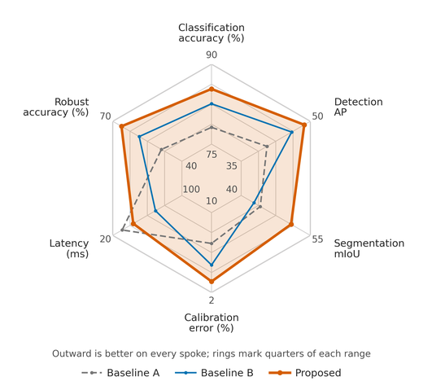</a></td><td align="center"><a href="figures/fig122_critical_difference.py">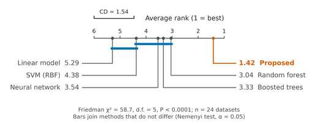</a></td><td align="center"><a href="figures/fig123_pareto_front.py">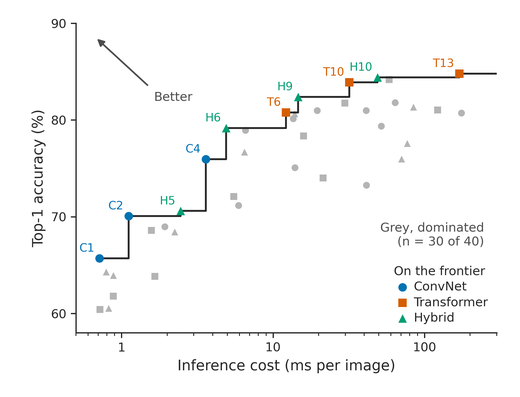</a></td><td align="center"><a href="figures/fig124_parallel_coordinates.py">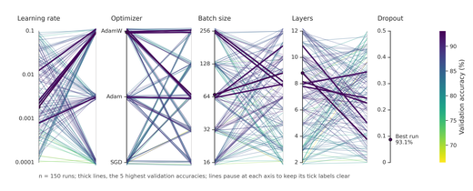</a></td><td align="center"><a href="figures/fig125_shap_beeswarm.py">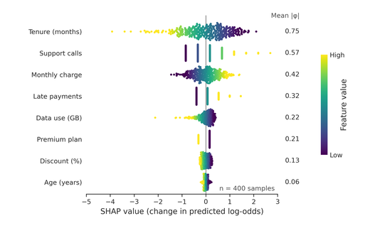</a></td></tr>
<tr><td align="center"><a href="figures/fig126_gp_regression.py">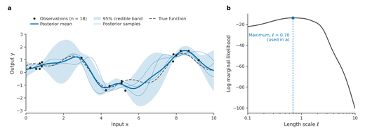</a></td><td align="center"><a href="figures/fig127_genome_tracks.py">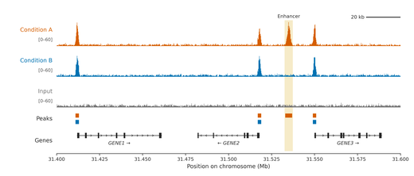</a></td><td align="center"><a href="figures/fig128_sequence_logo.py">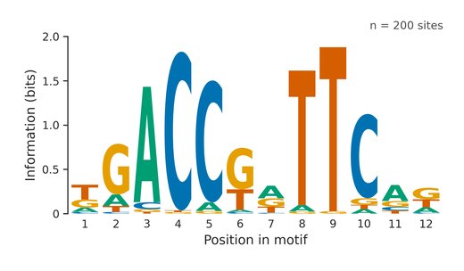</a></td><td align="center"><a href="figures/fig129_oncoprint.py">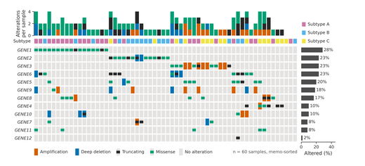</a></td><td align="center"><a href="figures/fig130_lollipop_mutations.py">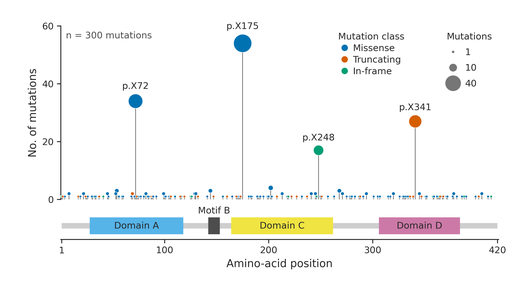</a></td></tr>
<tr><td align="center"><a href="figures/fig131_hic_contact_triangle.py">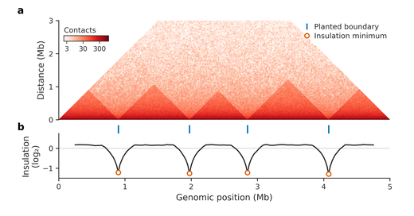</a></td><td align="center"><a href="figures/fig132_tree_trait_heatmap.py">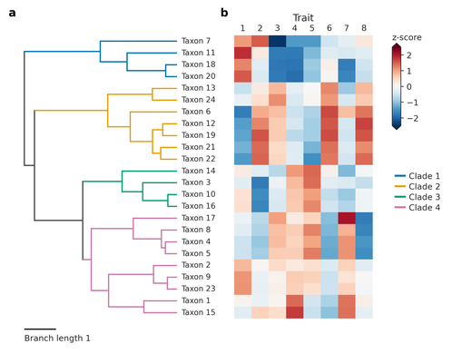</a></td><td align="center"><a href="figures/fig133_swimmer_plot.py">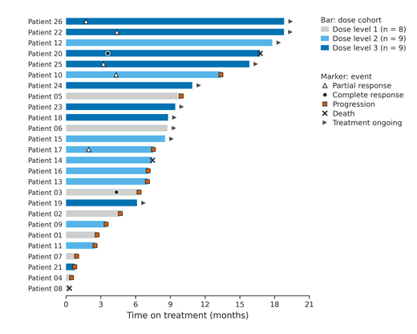</a></td><td align="center"><a href="figures/fig134_response_waterfall.py">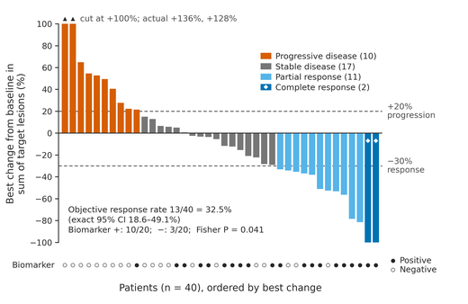</a></td><td align="center"><a href="figures/fig135_consort_flow.py">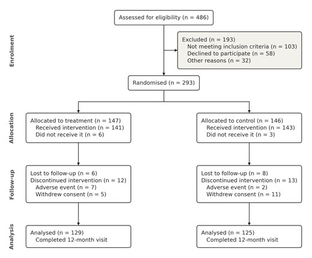</a></td></tr>
<tr><td align="center"><a href="figures/fig136_competing_risks_cif.py">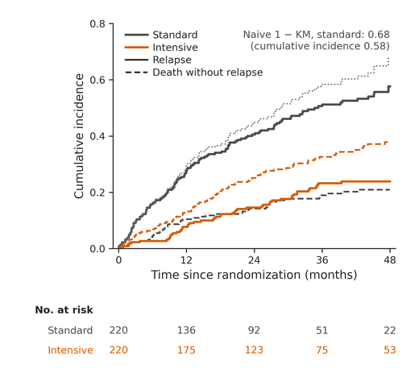</a></td><td align="center"><a href="figures/fig137_decision_curve.py">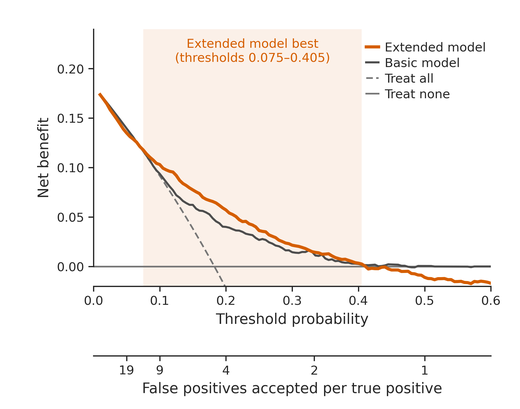</a></td><td align="center"><a href="figures/fig138_specification_curve.py">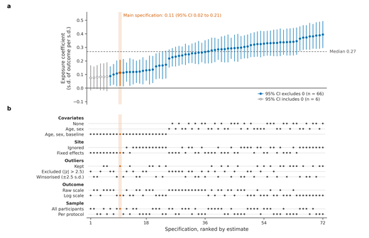</a></td><td align="center"><a href="figures/fig139_chord_diagram.py">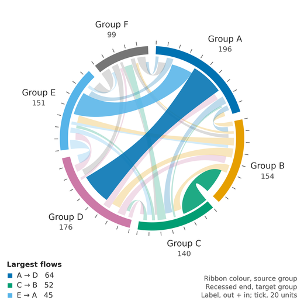</a></td><td align="center"><a href="figures/fig140_network_communities.py">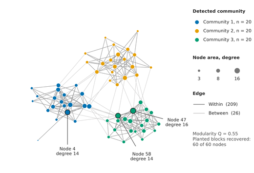</a></td></tr>
<tr><td align="center"><a href="figures/fig141_euler_proportional.py">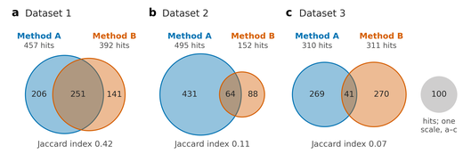</a></td><td align="center"><a href="figures/fig142_treemap_squarified.py">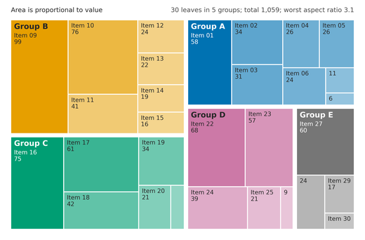</a></td><td align="center"><a href="figures/fig143_streamgraph.py">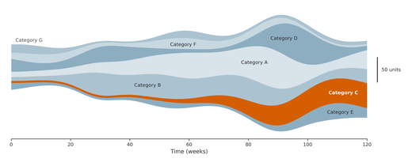</a></td><td align="center"><a href="figures/fig144_bump_chart.py">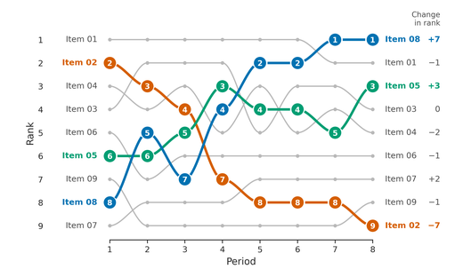</a></td><td align="center"><a href="figures/fig145_spectrogram_chirp.py">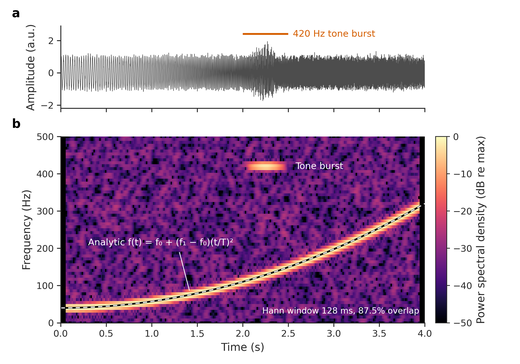</a></td></tr>
<tr><td align="center"><a href="figures/fig146_corner_posterior.py">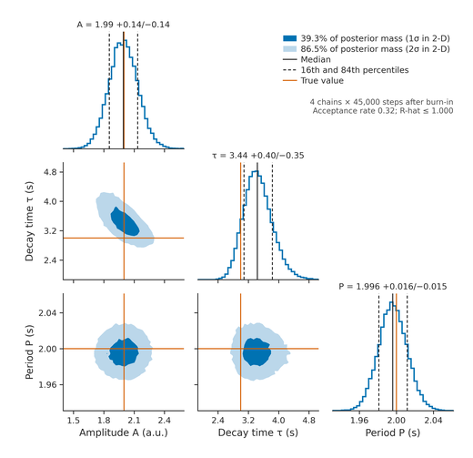</a></td><td align="center"><a href="figures/fig147_phase_portrait_fhn.py">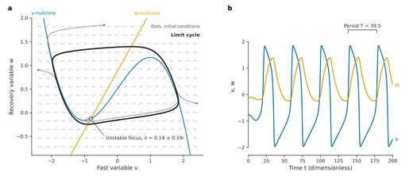</a></td><td align="center"><a href="figures/fig148_hh_traces_scalebars.py">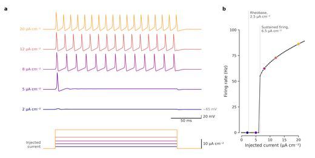</a></td><td align="center"><a href="figures/fig149_image_zoom_profile.py">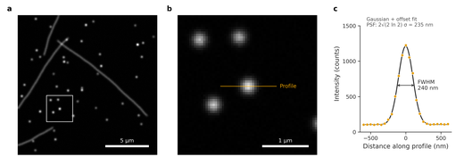</a></td><td align="center"><a href="figures/fig150_energy_landscape_3d.py">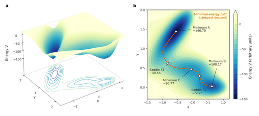</a></td></tr>
</table>

## Figures 101-120: manuscript panels at exact size

The first hundred let `constrained_layout` and a tight bounding box
choose the final size. The twenty in section **I** do what a journal
asks instead, through the shared module
[`figures/manuscript.py`](figures/manuscript.py): the canvas is set in
millimetres (89, 120 or 183 mm wide) and saved without a crop, margins
and gutters are in millimetres, type is 7/6 pt with a 5 pt floor, panel
letters sit at a fixed point offset, and multi-panel scripts assert
that their plot areas line up within 1.5 pt. Most revisit a figure type
from sections A-B and add what a reviewer asks for next -- confidence
bands and a cross-checked log-rank test on the Kaplan-Meier curves,
bootstrap intervals and a precision-recall panel beside the ROC curves,
Holm-adjusted exact P values on the bar chart. Each carries its own
built-in check, and all of their data are simulated.

## Figures 121-150: beyond the standard chart

Section **J** adds thirty figure types the first 120 did not cover,
all on `manuscript.py` at exact printed size and all with simulated
data:

- **Model evaluation (121-126)** - radar benchmark, critical-difference
  diagram, Pareto frontier, parallel coordinates, SHAP beeswarm,
  Gaussian-process regression.
- **Genomics (127-132)** - genome-browser tracks, sequence logo,
  oncoprint, mutation lollipop, Hi-C contact triangle, tree with trait
  heatmap.
- **Clinical research (133-138)** - swimmer plot, response waterfall,
  CONSORT flow diagram, competing-risks cumulative incidence,
  decision curve, specification curve.
- **Networks, flows, sets and rankings (139-144)** - chord diagram,
  community graph, area-proportional Euler diagrams, squarified
  treemap, streamgraph, bump chart.
- **Signals, inference, dynamics and imaging (145-150)** - chirp
  spectrogram, corner plot from a hand-coded sampler, phase portrait,
  Hodgkin-Huxley traces with scale bars, image zoom with line profile,
  3-D energy landscape.

Where a library would normally do the layout (chord ribbons, treemap,
streamgraph baseline, force-directed graph, logo glyphs, Aalen-Johansen
estimator, Metropolis-Hastings sampler) the script codes it from
scratch with numpy and scipy, and asserts a landmark the mathematics
fixes: ribbon ends tile every arc, rectangle areas match their values,
the two incidences and survival sum to one.

## Growing the library

The set is built to keep growing -- see
[`docs/ADDING_FIGURES.md`](docs/ADDING_FIGURES.md).
`python tools/new_figure.py 151 my_slug "description"` scaffolds a new
figure on the house contract (style sheet, seeded RNG, derived curves,
built-in self-check, twin outputs); one index line in
`figures/README.md` flows it into the guide and this gallery
automatically, and CI re-verifies everything on push.

## Verification

Every push renders every figure on GitHub Actions; the scripts'
built-in asserts are the test suite. The guide PDF is rebuilt
and uploaded as an artifact.

## Licences & citation

Code: [MIT](LICENSE). Rendered figures & guide:
[CC BY 4.0](LICENSE-FIGURES.md). To cite, see
[`CITATION.cff`](CITATION.cff) (GitHub's "Cite this repository" button
uses it).
